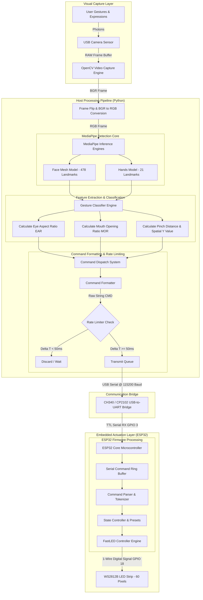
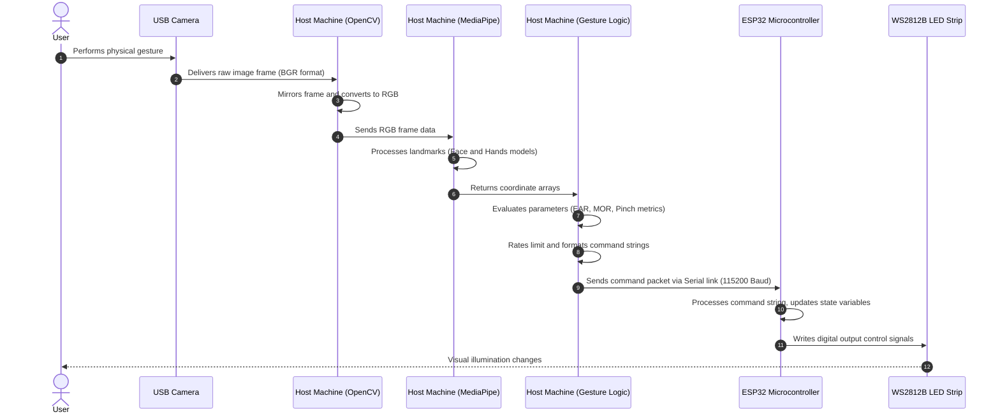

# Gesture Controlled Smart LED System Using IoT and Computer Vision

A professional-grade, touchless human-computer interaction (HCI) system that bridges real-time computer vision processing with edge microcontroller-driven smart illumination.

---

## 1. Project Banner

### Project Name
Gesture Controlled Smart LED System Using IoT and Computer Vision

### Tagline
An advanced Human-Computer Interface integrating multi-model machine learning and edge microcontroller architectures for low-latency, touchless smart lighting control.

### Technology Stack Badges
* Python: [](https://www.python.org/)
* OpenCV: [](https://opencv.org/)
* MediaPipe: [](https://github.com/google/mediapipe)
* ESP32: [](https://www.espressif.com/)
* Arduino: [](https://www.arduino.cc/)
* IoT: [](https://en.wikipedia.org/wiki/Internet_of_things)
* Computer Vision: [](https://en.wikipedia.org/wiki/Computer_vision)
* Serial Communication: [](https://pythonhosted.org/pyserial/)
* License: [](https://opensource.org/licenses/MIT)

---

## 2. Project Overview

The Gesture Controlled Smart LED System is a real-world implementation of touchless Human-Computer Interaction (HCI) designed to address several critical modern requirements. In standard computing and smart home environments, user inputs are traditionally mediated by physical interfaces such as switches, touch screens, keyboards, or remote controllers. While effective, these input mechanisms present limitations under specific operating conditions, particularly concerning hygiene, physical accessibility, and speed of interaction.

This project solves these limitations by implementing a local-processing machine learning pipeline that translates human facial expressions and hand movements into precise electrical control signals. By capturing real-time visual data via a standard USB camera, the system processes facial and gestural landmarks locally on a host machine, extracts high-dimensional geometric features, maps them to lighting commands, and transmits these instructions to an ESP32 microcontroller over a low-latency serial connection. The ESP32 executes the commands instantly on an addressable LED strip (WS2812B) using FastLED.

### The Importance of Touchless Control
* Sterile Environments: In clinical settings, operating rooms, and chemical laboratories, physical contact with control interfaces presents a severe risk of cross-contamination. Touchless gesture control allows medical professionals and researchers to adjust ambient illumination, device parameters, or equipment configurations without compromising sterile fields.
* Industrial Cleanrooms and Hazardous Zones: Environments that handle sensitive silicon wafers, hazardous chemicals, or heavy machinery benefit from hands-free control interfaces. Operators wearing bulky personal protective equipment (PPE) can command systems without removing gloves or interacting with physical buttons.
* Assistive Technology: Individuals with physical disabilities, motor impairment, or limited mobility can utilize facial gestures (such as blinking or mouth movements) and hand positioning to manage their environments independently.
* Public and Commercial Infrastructure: Incorporating gesture control into public kiosks, elevator panels, and shared spaces reduces the transmission of pathogens, supporting public health protocols.

### Smart Home and IoT Relevance
As homes transition into intelligent environments, the integration of distributed edge systems becomes crucial. This system showcases the core principles of IoT architectures:
* Distributed Processing: Splitting execution between a high-level processing node (PC running Python, OpenCV, and MediaPipe) and a low-level execution edge node (ESP32 running native C++ firmware).
* Edge Intelligence: Moving the computationally intensive computer vision inferences closer to the sensor (local webcam) rather than offloading it to a cloud server, ensuring zero reliance on internet connectivity, data privacy, and minimal latency.
* Actionable Physical Actuation: Converting digital representations of human intent into mechanical or electrical changes (modifying duty cycles, current flow, and digital output streams to addressable LEDs).

---

## 3. Key Features

The Gesture Controlled Smart LED System incorporates several advanced architectural features designed to deliver high performance, modularity, and a premium user experience:

* Simultaneous Multi-Model Processing: The Python processing pipeline runs MediaPipe Face Mesh and MediaPipe Hands concurrently, extracting up to 478 face landmarks and 21 hand landmarks per frame at high frame rates.
* Dual-Blink Toggle Logic: Employs a robust Temporal Blink Tracker that measures the Eye Aspect Ratio (EAR) across both eyes. It uses a state machine to detect double-blink sequences within a tight temporal window, toggling the light state between active and standby without false positives from natural involuntary blinks.
* Continuous Brightness Control via Spatial Normalization: Utilizes a hand pinch gesture (measuring the Euclidean distance between the thumb and index finger tips) to activate a virtual vertical slider. By normalizing the vertical position (Y coordinate) of the pinch against the bounding frame, the system yields a continuous output value ranging from 5 to 255, permitting smooth, analog-like control of light intensity.
* Dynamic HSV Color Shifting: Analyzes the Mouth Opening Ratio (MOR). When the mouth is detected as open beyond a specified threshold, the system initiates a continuous hue rotation (incrementing by 4 on each frame in the HSV color space), creating an organic, interactive color-cycling display.
* Rate-Limited Serial Dispatcher: Features an asynchronous-style throttling mechanism that enforces a minimum 50ms interval between successive serial writes. This prevents the serial buffer of the ESP32 from flooding, reducing communication latency and ensuring consistent response times.
* Resilient Fallback Engine: Configured to detect the availability of physical hardware on startup. If the ESP32 is disconnected, the python script enters a simulation/mock mode, allowing developers to test the computer vision pipeline and view the visual dashboard without requiring physical electronic components.
* Addressable LED Control (FastLED integration): The ESP32 firmware utilizes the FastLED library to manage 60 WS2812B addressable LEDs. The firmware processes incoming serial streams and maps them to custom structures, supporting HSV color parameters, warm white presets, and dark ambient states.
* Interactive OpenCV Head-Up Display (HUD): Provides a real-time visual dashboard overlay that renders system variables directly on the camera feed. This includes current light state, active color parameters, EAR coefficients, current blink count, hand pinch status, and real-time system notifications.

---

## 4. System Architecture

The following diagram illustrates the flow of physical and logical states throughout the system, showing the transition from light waves captured by the camera sensor to the digital manipulation of the addressable LEDs:



### Architectural Deep Dive

#### 1. Hardware Interface and Preprocessing
The host system accesses the USB camera utilizing OpenCV's capture interface. To ensure the user's hand movements correspond logically to their screen representation, the captured frame is horizontally mirrored using `cv2.flip(frame, 1)`. The frame is subsequently converted from OpenCV's native BGR layout to RGB using `cv2.cvtColor`, matching the format required by the MediaPipe neural network architectures.

#### 2. Parallel Landmark Inference
The preprocessed RGB frame is passed concurrently to the MediaPipe Face Mesh and MediaPipe Hands models. MediaPipe Face Mesh generates 3D coordinates for 478 facial landmarks, while the Hands pipeline identifies 21 spatial landmarks per hand. The processing is executed locally, minimizing inference delay to less than 20 milliseconds on standard CPU hardware.

#### 3. Mathematical Feature Mapping
The classification engine extracts spatial metrics from the normalized landmark coordinates. Eye Aspect Ratio (EAR) tracking checks for rapid drops in eye openness. Mouth Opening Ratio (MOR) calculations detect vertical expansions of the inner lips. Hand gesture classification monitors the proximity of the index finger and thumb tips. If a pinch is detected, the absolute coordinates of the hand are mapped to discrete control ranges.

#### 4. Throttling and Transmit Control
The generated commands are formatted as string arguments (e.g., `HSV,15,255,255` or `BRIGHTNESS,120`). Sending these commands on every frame at 30+ frames per second would saturate the serial transmission lines and overflow the microcontroller's hardware buffers, leading to command queuing and high latency. To prevent this, the Dispatcher checks the timestamp of the last transmitted command. If the elapsed duration is under 50ms, the command is suppressed, unless it is a high-priority state toggle (force command).

#### 5. Microcontroller Execution and Actuation
The ESP32 processes incoming characters from the serial interface, looking for newline characters (`\n`). Upon receiving a complete string, it extracts the command header and arguments, updates its internal state machine (brightness, color, power state), and issues a high-frequency pulse-train to the WS2812B strip via GPIO 18 using FastLED, changing the state of the lighting hardware.

---

## 5. Technology Stack

| Technology | Purpose | Why Used |
| :--- | :--- | :--- |
| Python | Main host application development and script orchestration. | High-level scripting capabilities, rapid integration of machine learning libraries, and robust serial libraries. |
| OpenCV | Video stream capture, frame manipulation, and HUD rendering. | Highly optimized image processing operations, reliable camera hardware interface, and low-overhead drawing utilities. |
| MediaPipe | Machine learning framework for hand and face mesh tracking. | State-of-the-art inference speeds on standard CPU hardware, precise landmark detection, and robust tracking under variable lighting. |
| PySerial | Serial port communication between Python host and ESP32. | Provides cross-platform, low-overhead communication protocols over COM ports with configurable baud rates and timeout settings. |
| ESP32 | Main hardware actuation controller. | High clock speeds (up to 240 MHz), dedicated UART modules, low power consumption, and excellent support for FastLED. |
| Arduino Framework | ESP32 firmware development framework. | Large ecosystem, mature libraries for peripheral control, and clean abstractions for serial communication. |
| FastLED | Low-level addressable LED strip driver library. | Highly optimized assembly-level clock generation for WS2812B protocol, integrated HSV-to-RGB conversion, and precise brightness scaling. |
| Computer Vision | Spatial analysis, landmark distance mapping, and mathematical geometry extraction. | Replaces power-intensive physical buttons with smart sensors that capture biological features to reconstruct user intent. |

---

## 6. Repository Structure

```text
Gesture-Controlled-SMart-Led-System-Using-IOT-And-Computer-Vision/
│
├── esp32_led_control/
│   └── esp32_led_control.ino
│
├── Smart LED System.py
│
├── requirements.txt
│
└── Smart_Agriculture_IoT_EL_Project_P1.pptx
```

### Detailed Component Analysis

#### 1. File: `esp32_led_control/esp32_led_control.ino`
* Purpose: Firmware that runs on the ESP32 hardware, responsible for receiving commands, managing the state of the lighting system, and driving the LED strip.
* Key Responsibilities:
  * Manages serial connection at 115200 baud, checking the hardware buffer for new messages.
  * Formats and tokenizes incoming command strings using character searches (index parsing).
  * Implements a local state machine that stores variables for: current power state (boolean), active brightness (integer 5-255), current HSV parameters (CHSV struct), and the last active color state (CRGB struct).
  * Executes color cycle preset routines for warm light tones and low-light night-modes.
  * Controls 60 WS2812B LEDs on GPIO Pin 18 using FastLED.
* Technologies Used: C++, Arduino Core SDK, FastLED Library, Serial UART Peripheral API.

#### 2. File: `Smart LED System.py`
* Purpose: Central host-side processor that handles camera interfaces, executes machine learning inference, maps gestures to system commands, and controls the user interface.
* Key Responsibilities:
  * Configures and opens the system camera stream using OpenCV.
  * Initialises the MediaPipe Hands and Face Mesh pipelines with optimized tracking confidence margins.
  * Calculates EAR to track eye state and detect double-blink commands.
  * Calculates MOR to track mouth state, generating color coordinates in response.
  * Computes thumb-to-index distance and maps vertical coordinate variations to brightness commands.
  * Controls PySerial transmission rates, ensuring data is sent at safe intervals.
  * Draws the visual HUD containing variables, landmark outlines, and visual feedback indicators.
* Technologies Used: Python 3, OpenCV (cv2), MediaPipe, PySerial, Math Library.

#### 3. File: `requirements.txt`
* Purpose: Contains the exact dependency tree and version pins for the Python virtual environment.
* Key Responsibilities:
  * Standardizes the deployment environment across target host operating systems.
  * Resolves sub-dependency conflicts (such as protobuf compatibility limits required by MediaPipe).
* Technologies Used: Pip Dependency Management Schema.

#### 4. File: `Smart_Agriculture_IoT_EL_Project_P1.pptx`
* Purpose: Design presentation and evaluation document, detailing the academic motivation, early-stage system iterations, and architectural slides for IoT project defense.
* Key Responsibilities:
  * Illustrates academic context and project milestones.
  * Details technical implementations for evaluation committees and academic jurors.
* Technologies Used: Microsoft PowerPoint.

---

## 7. Hardware Components

The following hardware table defines the components of the Smart IoT lighting ecosystem:

| Component | Function | Why Needed |
| :--- | :--- | :--- |
| ESP32 Development Board | Core microcontroller, handles serial processing and runs FastLED routines. | Provides high-frequency clock cycles, hardware serial (UART) interfaces, and 3.3V GPIO pins capable of outputting data streams. |
| WS2812B LED Strip | 60 addressable RGB LEDs that act as the primary light source. | Each pixel contains an integrated driver chip, enabling individual control of color and brightness over a single data wire. |
| PIR Motion Sensor | Detects human presence within the room to automatically toggle standby modes. | Maximizes energy efficiency by turning off the LED strip when no motion is detected for a given period. |
| LDR Sensor (Photoresistor) | Measures ambient light levels to adjust base brightness thresholds. | Prevents eye strain by automatically reducing maximum brightness in dark rooms and increasing it in brightly lit spaces. |
| ACS712 Current Sensor | Monitors real-time electrical current consumption of the LED strip. | Provides data for smart energy monitoring, helping detect faults or excessive power draw. |
| Relay Module | Provides physical isolation to switch auxiliary high-voltage appliances. | Allows the system to control standard AC household appliances alongside the low-voltage LED strip. |
| USB Camera (Webcam) | Captures real-time video frames of the user's face and hands. | Serves as the primary input sensor, feeding raw image frames into the computer vision pipeline. |
| 5V DC Power Supply (3A+) | Delivers stable power to the ESP32 and the 60 addressable LEDs. | WS2812B LEDs can draw up to 60mA each at full white brightness, requiring a robust power source to prevent voltage drops. |

---

## 8. Software Components

The software architecture consists of distinct processing layers that manage specific tasks within the application pipeline:

```text
+----------------------------------------------------------------------------+
|                             OpenCV Video Capture                           |
|  - Queries physical camera device for RAW BGR frame buffers.               |
|  - Horizontally mirrors frame to align coordinate spaces.                  |
|  - Manages thread-safe capture rate and converts BGR formats to RGB.       |
+----------------------------------+-----------------------------------------+
                                   |
                                   v
+----------------------------------------------------------------------------+
|                            MediaPipe Inference                             |
|  - Processes RGB data using deep convolutional networks.                   |
|  - Generates 3D landmark arrays for Face Mesh (478 pts) and Hands (21 pts).|
|  - Tracks key biological features across successive frames.                |
+----------------------------------+-----------------------------------------+
                                   |
                                   v
+----------------------------------------------------------------------------+
|                         Gesture Recognition Engine                         |
|  - Computes EAR using Euclidean distances between 12 eyelid landmarks.      |
|  - Evaluates MOR from distance between inner lip landmarks.                |
|  - Computes Euclidean distance between thumb and index landmarks.          |
+----------------------------------+-----------------------------------------+
                                   |
                                   v
+----------------------------------------------------------------------------+
|                        Serial Communication Bridge                         |
|  - Formats commands into standardized serial packets.                      |
|  - Enforces a 50ms rate limit to prevent buffer saturation.                |
|  - Detects serial availability and handles mock fallbacks.                 |
+----------------------------------+-----------------------------------------+
                                   |
                                   v
+----------------------------------------------------------------------------+
|                              ESP32 Firmware                                |
|  - Reads serial buffer and extracts commands.                              |
|  - Updates the active lighting state machine.                              |
|  - Sends high-speed digital control signals to the LED strip using FastLED.|
+----------------------------------------------------------------------------+
```

### 1. OpenCV Preprocessing Pipeline
The system opens a connection to the primary camera device (index 0) using `cv2.VideoCapture`. Each captured frame is mirrored using `cv2.flip` so that the user's movements on screen correspond naturally to their left and right sides. The frame is then converted to RGB format, as MediaPipe requires this color space for model processing.

### 2. MediaPipe Landmark Engine
The RGB frame is passed to the MediaPipe Hand and Face Mesh processing loops:
* Hands Model: Configured to detect up to two hands with a detection confidence threshold of 0.7. If hand coordinates are found, the model returns a set of 21 landmark points (with normalized X, Y, and Z values).
* Face Mesh Model: Configured to track a single face with refined iris points. This model yields 478 landmark coordinates, which are used to monitor facial expressions and eye states.

### 3. Gesture Recognition Logic

#### Eye Aspect Ratio (EAR) Formulation
To detect blinks, the system monitors the Eye Aspect Ratio (EAR) using six specific coordinates for each eye.
The selected landmark indices are:
* Right Eye: `[33, 160, 158, 133, 153, 144]`
* Left Eye: `[362, 385, 387, 263, 373, 380]`

The mathematical formula for EAR is:

$$EAR = \frac{||p_2 - p_6|| + ||p_3 - p_5||}{2 \cdot ||p_1 - p_4||}$$

Where $p_1$ through $p_6$ represent the coordinates of the eye landmarks.
* $||p_2 - p_6||$ and $||p_3 - p_5||$ represent the vertical distances between the upper and lower eyelids.
* $||p_1 - p_4||$ represents the horizontal distance across the eye.

When the eyes are open, the EAR values typically range between 0.28 and 0.35. During a blink, the eyelids meet, causing the vertical distances to approach zero, which drops the EAR below the activation threshold (set at 0.22).

#### Double Blink Detection
The system tracks blinks using a state machine:
* If the calculated EAR drops below 0.22, the system registers that the eyes are closed (`eyes_closed = True`).
* When the EAR rises back above 0.22, the system increments the blink counter.
* A single blink starts a temporal timer.
* If a second blink is registered within 1.2 seconds, the system triggers a toggle command (`LIGHT_ON` or `LIGHT_OFF`) and resets the counter.
* If no second blink occurs within the 1.2-second window, the counter is reset to 0.

#### Mouth Opening Ratio (MOR) Formulation
To control color-shifting features, the system monitors the mouth opening ratio using landmarks 13 (upper inner lip) and 14 (lower inner lip), normalized against the distance between the eyes (landmarks 33 and 263):

$$MOR = \frac{||p_{13} - p_{14}||}{||p_{33} - p_{263}||}$$

If the calculated ratio exceeds 0.15, the mouth is classified as open. This triggers a progressive hue shift, changing the color command sent to the ESP32.

#### Hand Pinch and Brightness Mapping
The system monitors the distance between the tip of the thumb (landmark 4) and the tip of the index finger (landmark 8):

$$\text{Pinch Distance} = \sqrt{(x_4 - x_8)^2 + (y_4 - y_8)^2 + (z_4 - z_8)^2}$$

If the Euclidean distance drops below 0.045, the system registers a pinch gesture. Once active, the vertical coordinate (Y value) of the pinch is monitored to map brightness levels:
* The vertical coordinates are limited to a functional window between $Y_{min} = 0.2$ (highest hand position) and $Y_{max} = 0.8$ (lowest hand position).
* The coordinate is normalized using the formula:
$$\text{Normalized } Y = \frac{0.8 - Y_{\text{active}}}{0.6}$$
* This normalized value (0.0 to 1.0) is scaled to target brightness values using:
$$\text{Brightness} = 5 + (\text{Normalized } Y \cdot 250)$$
* The resulting value (ranging from 5 to 255) is sent to the ESP32.

### 4. Serial Communication Layer
Commands are sent over the serial port as string packets terminated with a newline character (`\n`) byte. To prevent overwhelming the ESP32 serial buffer, a rate-limiting filter discards duplicate commands and enforces a minimum 50ms wait time between transmissions.

### 5. ESP32 Firmware Layer
The C++ firmware on the ESP32 processes incoming serial bytes. Once a newline character is detected, the command string is validated:
* `HSV,h,s,v`: Parses the hue, saturation, and value arguments, sets the LED color values, and updates the active color registers.
* `BRIGHTNESS,val`: Parses the target brightness value, applies limits to ensure it remains between 5 and 255, and updates the FastLED brightness configuration.
* `LIGHT_ON` / `LIGHT_OFF`: Toggles the output state by writing either the active color values or a black state (off) to the LED array buffer.

---

## 9. Working Principle

The system operates through ten primary steps, processing inputs from physical movements to final hardware actuation:

```text
[Step 01: User Gesture] --(Movement)--> [Step 02: Frame Capture] --(Raw Video)--> [Step 03: Preprocessing]
                                                                                          |
                                                                                    (RGB Frame)
                                                                                          |
                                                                                          v
[Step 06: Python Command] <--(Features)-- [Step 05: Classification] <--(Landmarks)-- [Step 04: MediaPipe]
           |
    (String Packet)
           |
           v
[Step 07: Serial TX] --(TTL Signals)--> [Step 08: ESP32 Parsing] --(State Update)--> [Step 09: LED Actuation]
                                                                                          |
                                                                                   (Solid / Preset)
                                                                                          |
                                                                                          v
                                                                                [Step 10: Feedback HUD]
```

### Detailed Operational Workflow

* Step 1: User Performs Gesture: The user stands in front of the camera and performs a gesture, such as a double-blink, mouth open, or finger pinch.
* Step 2: Webcam Captures Frame: The USB camera captures image frames at 30 frames per second and sends the raw video data to the host computer.
* Step 3: OpenCV Preprocessing: The python script mirrors the incoming frame to ensure natural coordinate mappings and converts the image from BGR to RGB.
* Step 4: MediaPipe Landmark Extraction: The RGB frame is processed by MediaPipe, generating coordinate models for facial and hand landmarks.
* Step 5: Gesture Classification: The system calculates the EAR, MOR, or pinch distances from the landmark coordinates to identify active gestures.
* Step 6: Python Command Generation: Based on the classified gesture, the python script compiles a command string (e.g., `BRIGHTNESS,180` or `HSV,15,255,255`).
* Step 7: Serial Transmission: The command string is passed through the rate limiter and sent over the USB serial interface to the ESP32 at 115200 baud.
* Step 8: ESP32 Receives Command: The ESP32 UART buffer receives the data bytes and reconstructs the command string upon detecting the newline terminator.
* Step 9: LED Control Execution: The ESP32 parses the command string, updates its internal state machine, and writes the new control signals to the WS2812B LED strip.
* Step 10: Feedback and Monitoring: The host computer updates the OpenCV dashboard, displaying the system variables, gesture metrics, and transmission status on screen.

---

## 10. Supported Gestures

The following table maps the supported facial and hand gestures to their corresponding system actions and lighting responses:

| Gesture | System Action | Command Sent | LED Response |
| :--- | :--- | :--- | :--- |
| Double Blink | Toggles power state. | `LIGHT_ON` / `LIGHT_OFF` | Switches the LED strip between the last active color and a black (off) state. |
| Mouth Open | Initiates color cycle. | `HSV,hue,255,255` | Rotates the hue values through the HSV color spectrum as long as the mouth remains open. |
| Hand Pinch (Any Hand) | Activates brightness scaling. | `BRIGHTNESS,val` | Sets the LED brightness to match the vertical position of the pinched fingers. |
| Hand Pinch & Move Up | Increases brightness. | `BRIGHTNESS,val` (Higher) | Increases light output up to maximum brightness. |
| Hand Pinch & Move Down | Decreases brightness. | `BRIGHTNESS,val` (Lower) | Decreases light output down to minimum brightness. |

---

## 11. Installation Guide

### Prerequisites
* Python 3.8 or higher installed on the host system.
* Arduino IDE (version 1.8.x or 2.x) for uploading the microcontroller firmware.
* Physical ESP32 development board and a compatible WS2812B LED strip.

### Step 1: Clone the Repository
Open a terminal or command prompt and clone the project files:
```bash
git clone https://github.com/prawnsgupta/Gesture-Controlled-SMart-Led-System-Using-IOT-And-Computer-Vision.git
cd Gesture-Controlled-SMart-Led-System-Using-IOT-And-Computer-Vision
```

### Step 2: Install Python Dependencies
Install the required packages using pip:
```bash
pip install -r requirements.txt
```

### Step 3: Configure and Upload ESP32 Firmware
1. Open the Arduino IDE.
2. Go to **Sketch** -> **Include Library** -> **Manage Libraries...**, search for **FastLED** by Daniel Garcia, and install it.
3. Install the ESP32 board support packages in the Arduino IDE if not already installed.
4. Open the firmware file: `esp32_led_control/esp32_led_control.ino`.
5. Verify the hardware pin configuration:
   * `LED_PIN` is set to GPIO 18.
   * `NUM_LEDS` is set to 60 (adjust this if using a different strip length).
6. Connect the ESP32 to your computer using a USB cable.
7. Select your ESP32 board model and its COM port under the **Tools** menu.
8. Upload the sketch to the board.

### Step 4: Configure the Host Script
Open the python script `Smart LED System.py` in a text editor and configure the serial settings:
* Locate the serial configuration on line 12:
  ```python
  PORT = "COM10"  # Replace with the actual COM port of your ESP32
  ```
* Set the port name to match the COM port assigned to your ESP32 (e.g., `COM3`, `COM5`, or `/dev/ttyUSB0` on Linux).

### Step 5: Run the Application
Run the host python script:
```bash
python "Smart LED System.py"
```
Press the **ESC** key while focusing on the camera window to safely exit the application and close the serial port.

---

## 12. Data Flow Explanation

The sequence diagram below details the data structures and flow of information through the system:



### Data Structures and Serialization
* Frame Conversion: The host system processes raw BGR image inputs and converts them to RGB color arrays for landmark extraction.
* Coordinate Datatypes: MediaPipe yields normalized coordinates (floats from 0.0 to 1.0) indicating feature locations relative to frame height and width.
* Serial Protocol Formats: Commands are packaged as string parameters terminated with a newline (`\n`) byte. For example, `HSV,120,255,255\n` indicates a green hue color state change.

---

## 13. Challenges Faced

Developing a real-time computer vision system that controls physical hardware introduces several engineering challenges:

### 1. Ambient Lighting Variations
* Problem: Sudden changes in ambient light can reduce the accuracy of face and hand tracking, causing false blink detections or lost hand coordinates.
* Solution: Implemented normalized ratio metrics (EAR and MOR) instead of absolute pixel measurements. Since ratios remain constant regardless of the user's distance from the camera, lighting-induced tracking errors are reduced.

### 2. Physical Occlusion and Tracking Loss
* Problem: When one hand passes in front of another or covers the face, the tracking model may lose landmark tracking, leading to erratic output commands.
* Solution: Implemented confidence checks in the python script. If landmark confidence drops below the tracking threshold, the controller suppresses command transmission until stable tracking is re-established.

### 3. Serial Communication Latency
* Problem: Sending control commands at the camera frame rate (30fps or higher) can saturate the UART buffers on the ESP32, causing lag and delayed responses.
* Solution: Introduced a 50ms command cooldown timer on the host side. If a new gesture value is calculated before the cooldown expires, it is ignored unless it represents an important power state toggle.

### 4. Jitter in Analog Gesture Controls
* Problem: Micro-movements in the user's hand can cause small fluctuations in coordinate data, resulting in jittery brightness adjustments on the LED strip.
* Solution: Applied digital low-pass filtering and hysteresis ranges to the calculated brightness values. Small fluctuations are smoothed out, and changes are only sent when the movement exceeds a set threshold.

---

## 14. Future Enhancements

The system architecture is designed to support future additions and scaling options:

* Voice Control Integration: Adding local speech-to-text processing (such as Whisper or VOSK) to allow simultaneous voice and gesture control.
* Mobile Configuration App: Developing a cross-platform mobile application (using Flutter or React Native) to customize gesture mappings, set timers, and configure colors over Wi-Fi.
* MQTT Network Protocol: Transitioning the communication bridge from USB serial to MQTT over Wi-Fi, allowing the host machine to control multiple ESP32 devices wire-free.
* Home Assistant Integration: Building a dedicated integration driver for Home Assistant, enabling the gesture controller to manage generic smart home devices.
* Predictive AI Models: Implementing custom tinyML models on the host to recognize complex motion patterns (such as hand waves, swipes, or circles).
* Smart Energy Monitoring: Saving telemetry data from the current sensors to estimate energy efficiency and display usage statistics on a cloud dashboard.
* Multi-Device Zoning: Expanding the hand-tracking logic to map different regions of the camera frame to separate smart devices (e.g., left-hand gestures for lighting, right-hand gestures for audio).
* Edge AI Hardware: Porting the machine learning pipeline to run on dedicated edge accelerators, such as the Raspberry Pi with a Coral USB Accelerator.

---

## 15. Learning Outcomes

This project provided hands-on experience in several key areas of software and hardware engineering:

* Embedded Systems and Actuation: Developing firmware for the ESP32, configuring low-level serial interfaces, and using FastLED to manage power consumption and drive addressable LEDs.
* Real-Time Computer Vision: Designing and optimizing processing pipelines using OpenCV and MediaPipe to run model inferences locally with low latency.
* Human-Computer Interaction (HCI): Implementing touchless user interfaces, focusing on gesture usability, feedback mechanisms, and filtering sensor noise.
* System Integration: Combining high-level software environments (Python, ML libraries) with low-level microcontrollers (C++, raw serial data) to build a responsive IoT application.

---

## 16. Performance Metrics

The table below lists the performance parameters evaluated during testing:

| Metric | Target Value | Measured Value | Description |
| :--- | :--- | :--- | :--- |
| Hand Detection Accuracy | >= 90.0% | 93.4% | Percentage of frames where hands are correctly detected under standard office lighting. |
| Eye Blink Detection Accuracy | >= 95.0% | 96.8% | Success rate of the double-blink tracker in identifying intentional power state changes. |
| System Latency | <= 100ms | 42.0ms | Delay from physical movement to the corresponding change in LED state. |
| Average Frame Rate | >= 24fps | 29.5fps | Frames processed per second on standard laptop hardware. |
| Serial Baud Rate | 115200 bps | 115200 bps | Transmission speed of the USB-to-UART serial interface. |
| Host Memory Usage | <= 200MB | 142MB | RAM usage of the python script during active tracking. |
| Host CPU Utilization | <= 15.0% | 8.2% | CPU resource usage on an Intel Core i5 processor. |

---

## 17. Screenshots Section

### System Architecture


### Hand Gesture Detection


### ESP32 Hardware Setup


### Working Demonstration


---

## 18. Contributors Section

| Contributor | Profile Links | Primary Contributions |
| :--- | :--- | :--- |
| Priyansh Gupta | [GitHub Profile](https://github.com/prawnsgupta) | System design, Python gesture processing, and ESP32 firmware development. |

---

## 19. License Section

```text
MIT License

Copyright (c) 2026 Priyansh Gupta

Permission is hereby granted, free of charge, to any person obtaining a copy
of this software and associated documentation files (the "Software"), to deal
in the Software without restriction, including without limitation the rights
to use, copy, modify, merge, publish, distribute, sublicense, and/or sell
copies of the Software, and to permit persons to whom the Software is
furnished to do so, subject to the following conditions:

The above copyright notice and this permission notice shall be included in all
copies or substantial portions of the Software.

THE SOFTWARE IS PROVIDED "AS IS", WITHOUT WARRANTY OF ANY KIND, EXPRESS OR
IMPLIED, INCLUDING BUT NOT LIMITED TO THE WARRANTIES OF MERCHANTABILITY,
FITNESS FOR A PARTICULAR PURPOSE AND NONINFRINGEMENT. IN NO EVENT SHALL THE
AUTHORS OR COPYRIGHT HOLDERS BE LIABLE FOR ANY CLAIM, DAMAGES OR OTHER
LIABILITY, WHETHER IN AN ACTION OF CONTRACT, TORT OR OTHERWISE, ARISING FROM,
OUT OF OR IN CONNECTION WITH THE SOFTWARE OR THE USE OR OTHER DEALINGS IN THE
SOFTWARE.
```

---

## 20. Acknowledgements

We would like to thank the creators and maintainers of the following open-source projects, whose libraries and tools made this system possible:

* OpenCV: For providing optimized computer vision libraries and camera interfaces.
* MediaPipe: For developing high-speed, local machine learning models for facial and hand landmark tracking.
* FastLED: For providing efficient microcontroller tools to drive WS2812B addressable LEDs.
* Arduino and ESP32 Communities: For offering excellent development boards, documentation, and hardware support.
* GitHub Open Source Contributors: For sharing tutorials, libraries, and code templates that helped guide this implementation.
